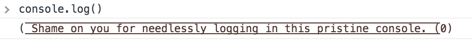

# console.log

### Introduction

I came across Tim Holman's [`console.frog`](https://github.com/tholman/console-dot-frog) project a while back and realized I'd been depriving myself of a lot of great amphibious development practices. I began to think about why `console.frog` felt so right after so much time programming, and came to the realization that it's not just frogs I've been missing, but that nowadays coding is too far removed from nature as a whole.

`console.frog` is to a log message as breathing through one's skin is to a prince: now they're frogs. However, developers can still write boring, artificial logs, so `console.log` is intended to change that.

In a nutshell, `console.log` overrides `console.log` to add more puns. It's written in ES6 with no dependencies, and its logging potential is best illustrated in Chrome (for both aesthetic and browser support reasons). 


### Examples

Traditional use of `console.log` works as follows:

```
console.log("I am a 'log'");
> I am a 'log'
```

The new and improved `console.log` carves that log message into an ASCII art representation of a felled tree (colored dark brown, of course) and gently rests it in the debugger:


Multi-line and -argument messages are placed into a logpile:


And finally, a reminder to stay environmentally conscious when logging for no good reason:




### Usage

Just include `console.log.js` in your application, and voilà, natural-looking logs that occasionally make you feel _just the right bit of shame_ for contributing to the environmental decline of our planet.


### Caveats

In an effort to reduce space and cozy up logpiles, logs are single-line with bark of `text-decoration: overline underline;` which makes the carving look tight, but still legible. 

Unfortunately it appears modern web consoles don't respect the `letter-spacing` CSS property. This reduces the uniformity of logs.

`console.log` joins its arguments, so it will not respect developers' own stylistic choices. 


### License

Copyright 2018 Duncan McIsaac

The MIT License
